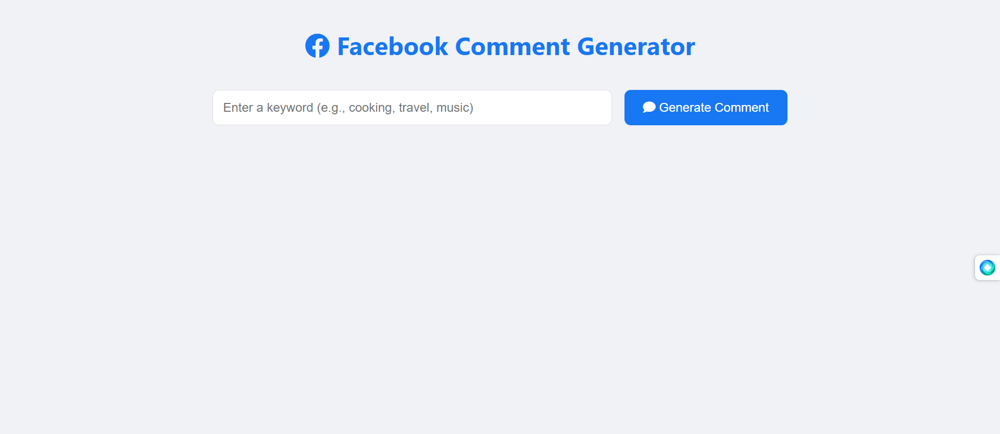
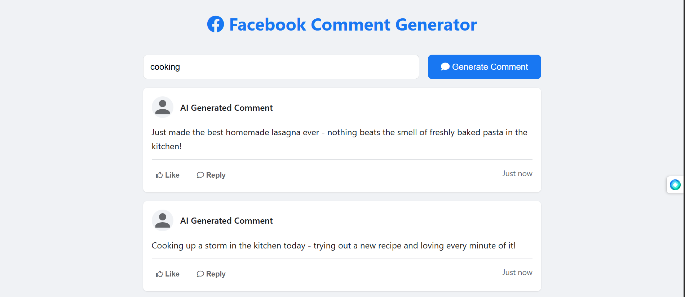

# AI-Based Facebook Comment Generator



This project is a simple web application that generates human-like Facebook comments based on a user-provided keyword. It uses a FastAPI backend and a simple HTML/CSS/JS frontend. The AI-powered comment generation is handled by the Groq API, providing extremely fast inference using open-source models like Llama 3.



## Features

- **Backend:** FastAPI POST endpoint `/generate_comment`.
- **Frontend:** A clean, single-page HTML application to interact with the backend.
- **AI Model:** Uses Groq's `llama-3.1-8b-instant` model for fast and high-quality comment generation.
- **Multiple Variations:** Generates 3 comment variations for each keyword.
- **Simple Interface:** Easy-to-use web interface.

## Tech Stack

- **Backend:** [FastAPI](https://fastapi.tiangolo.com/), [Groq](https://groq.com/), [Pydantic](https://pydantic-docs.helpmanual.io/)
- **Frontend:** HTML, CSS, JavaScript
- **Python Libraries:** `fastapi`, `uvicorn`, `groq`, `python-dotenv`

## Setup and Installation

Follow these steps to get the application running locally.

### 1. Prerequisites

- Python 3.8+
- A Groq API Key

### 2. Clone the Repository

(Assuming you have these files in a local directory)

### 3. Create a Virtual Environment

It's highly recommended to use a virtual environment to manage dependencies.

**On macOS/Linux:**
```bash
python3 -m venv venv
source venv/bin/activate
```

**On Windows:**
```bash
python -m venv venv
.\venv\Scripts\activate
```

### 4. Install Dependencies

Install all required Python packages from `requirements.txt`.

```bash
pip install -r requirements.txt
```

### 5. Set Up Your API Key

You need a free API key from [Groq](https://console.groq.com/keys).

1.  Create an account and generate a new API key.
2.  Create a file named `.env` in the same directory as `main.py`.
3.  Add your API key to the `.env` file like this:

    ```
    GROQ_API_KEY=gsk_YourSecretApiKeyGoesHere
    ```

The `main.py` file is configured to automatically load this key.

### 6. Run the Application

Use `uvicorn` to run the FastAPI server.

```bash
uvicorn main:app --reload
```

- `main`: Refers to the `main.py` file.
- `app`: Refers to the `app = FastAPI()` object inside `main.py`.
- `--reload`: Automatically restarts the server when you make changes to the code.

## How to Use

### 1. Using the Web Frontend

1.  Once the server is running, open your web browser and go to:
    [http://127.0.0.1:8000](http://127.0.0.1:8000)

2.  The application `index.html` will be served automatically.

3.  Type a keyword (e.g., "hiking", "pizza", "new puppy") into the input box.

4.  Click "Generate Comments".

5.  The AI-generated comments will appear below the button.

### 2. Using the API (e.g., with cURL)

You can also test the backend endpoint directly from your terminal using `curl`.

```bash
curl -X POST "http://127.0.0.1:8000/generate_comment" \
     -H "Content-Type: application/json" \
     -d '{"keyword": "gardening"}'
```

You should receive a JSON response similar to this:

```json
{
  "keyword": "gardening",
  "generated_comments": [
    "Your garden looks amazing! So much hard work paying off. 💚",
    "This is so peaceful to look at. Great job!",
    "Wow, you have such a green thumb! Looks beautiful."
  ]
}
```
